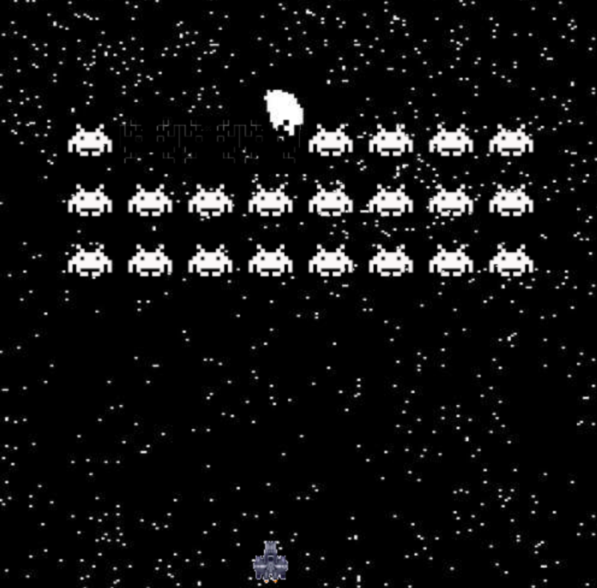

# Wollok space invaders

## Equipo de desarrollo

- Ignacio René
- Marcelo Fernández
- Agustín Sosa
- Ezequiel Orsingher

## Capturas

## Reglas de Juego / Instrucciones

Destruir todos los aliens de cada nivel antes de que los mismos lleguen a tocar el piso.
Instrucciones:
Utiliza las flechas para mover la nave y la tecla Enter para disparar.

## Otros

- Objetos 1 comision B. Universidad de Hurlingham
- Versión de wollok 0.2.11
- Una vez terminado, no tenemos problemas en que el repositorio sea público
